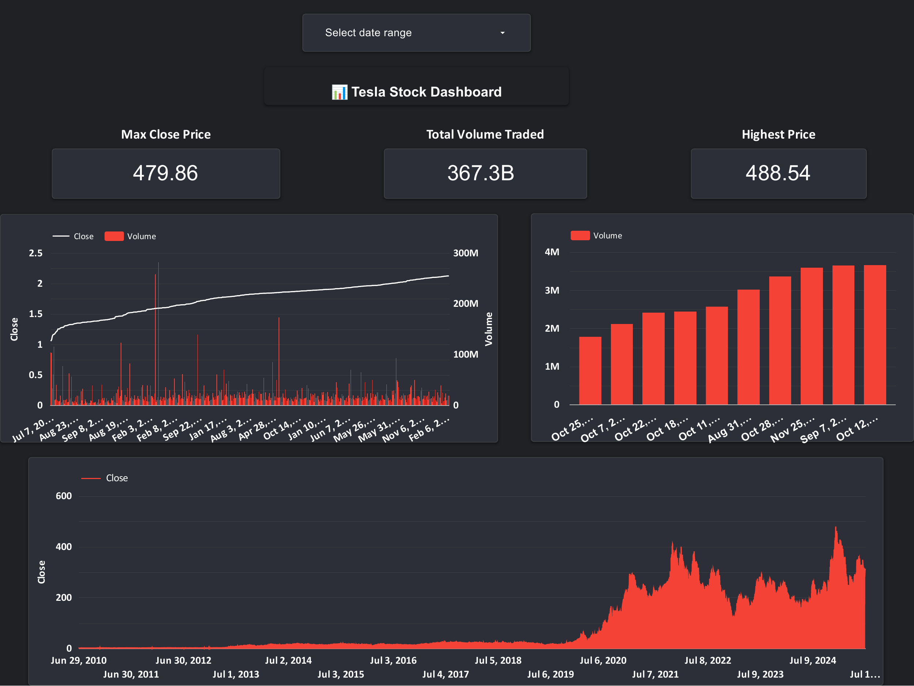
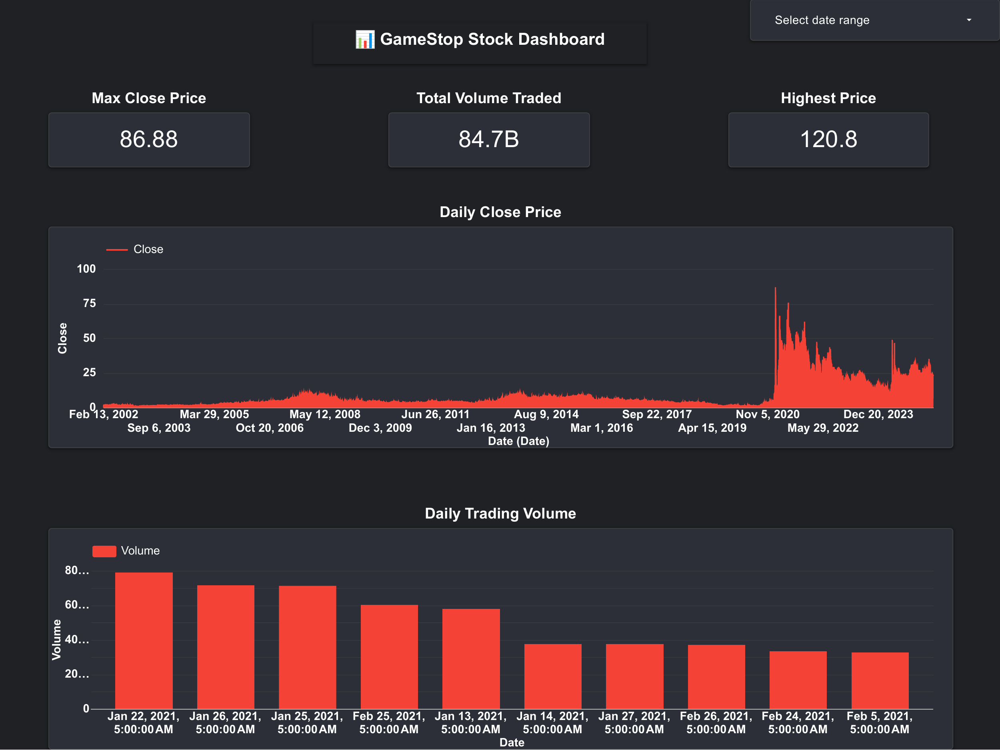

# WebScraping-Stocks-Data-using-API
# 📈 Tesla & GameStop Stock Dashboards (Google Looker Studio)

This repository contains an interactive data visualization report built using **Google Looker Studio**, displaying the historical stock performance of **Tesla** and **GameStop**. Data was extracted using the `yfinance` Python API, saved into Excel files via Jupyter Notebooks, and visualized using Looker Studio.

---

## 🌐 Live Dashboard

📊 **[View Interactive Dashboard on Looker Studio](https://lookerstudio.google.com/reporting/155fd1d6-a527-4c74-9676-69afa7b97a95)**  
> Page 1: Tesla Stock Dashboard  
> Page 2: GameStop Stock Dashboard

---

## 🧩 Dashboard Features

Each dashboard includes:

- ✅ Max Close Price
- ✅ Total Volume Traded
- ✅ Highest Price Reached

📊 Visuals:
- Line Chart: Daily Close Price
- Bar Chart: Daily Trading Volume
- Date Range Filter for interaction

---

## 📂 Files Included

### 📄 Dashboard Snapshots
- `Tesla_&_GameStop_Stock_Dashboard.pdf` — Static PDF of both dashboards
- `tesla_dashboard.png` — Screenshot of Tesla dashboard
- `gamestop_dashboard.png` — Screenshot of GameStop dashboard

### 📊 Stock Data Files
- `Tesla Stock Dashboard Data.xlsx` — Cleaned Tesla stock data
- `GameStop Stock Dashboard Data.xlsx` — Cleaned GameStop stock data

### 📓 Jupyter Notebooks (Web Scraping)
- `WebScraping Tesla Stock Data and create spreadsheet.ipynb`  
  → Pulls Tesla stock data using `yfinance` and saves to Excel

- `WebScraping GameStop Stock Data and create spreadsheet.ipynb`  
  → Pulls GameStop stock data using `yfinance` and saves to Excel

---

## 🖼️ Dashboard Previews

### 🚘 Tesla Stock Dashboard

---

### 🎮 GameStop Stock Dashboard

---

## 🛠️ Built With

- 📦 `yfinance` API — For stock market data
- 📊 Google Sheets — For data storage and refresh
- 📈 Google Looker Studio — For dashboard visualization
- 🧠 Python & Jupyter Notebook — For scraping and preprocessing

---

## 📃 License

This project is licensed under the **MIT License**.

---

## 🙌 Acknowledgements

- Data provided by Yahoo Finance via the `yfinance` Python package.
- Visualization created using **Google Looker Studio**.
